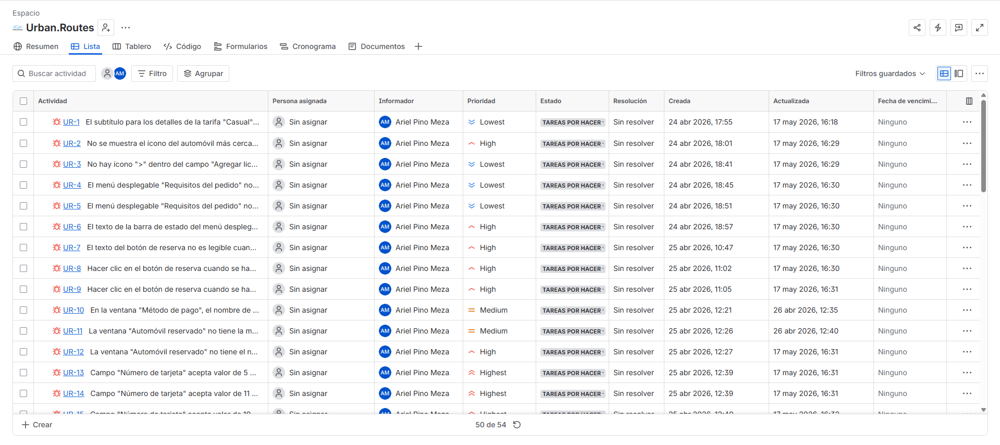
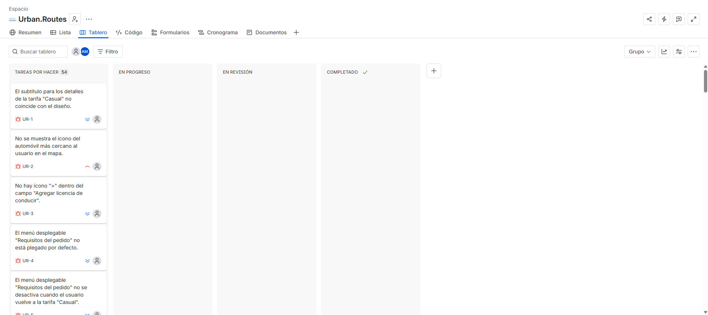

# Consolidated Defect Matrix (61 Identified Bugs)

## Module 1: Core Regression Bugs (7 Bugs)

| ID | Title | Steps to Reproduce | Expected Result | Actual Result | Severity |
| :--- | :--- | :--- | :--- | :--- | :---: |
| 

**UR-REG-01** | Map Area Labels Are Clickable and Display a Pop-up Window | 1. Open the Urban Routes application. 2. Click an area label on the map (example: Hollywood). | Nothing happens. Users cannot interact with map area labels. | A pop-up window with location details is displayed. | Minor |
| 

**UR-REG-02** | The "To" Field Does Not Display the Subway Station List When Entering the "Subway" Keyword | 1. Open the Urban Routes application. 2. Click the "To" field. 3. Type "Subway". | A list of subway stations is displayed. | Nothing happens. Objects cannot be searched in the "To" field. | Major |
| 

**UR-REG-03** | The Map Does Not Zoom In or Display the Location Pin After Entering an Address in the "From" Field | 1. Open the Urban Routes application. 2. Click the "From" field. 3. Enter an address (example: East 2nd Street, 601). | The map zooms in on the selected address pin. The view matches the design specifications. | The map remains static. No location pin is displayed and no zoom adjustment occurs. | Critical |
| 

**UR-REG-04** | The Map Does Not Zoom In or Display the Location Pin After Entering an Address in the "To" Field | 1. Open the Urban Routes application. 2. Click the "To" field. 3. Enter an address (example: 1300 1st St). | The map zooms in on the selected address pin. The view matches the design specifications. | The map remains static. No location pin is displayed and no zoom adjustment occurs. | Critical |
| 

**UR-REG-05** | The Map Does Not Update Its State After Clearing the Address Using the "X" Button in the "From" Field | 1. Open the Urban Routes application. 2. Enter an address in the "From" field (example: East 2nd Street, 601). 3. Click the "X" button in the "From" field. | The field is cleared. The previously entered address is removed from the field. The corresponding map marker disappears from the map. | The field is cleared correctly, but the map does not react or update its state (linked to the issue where the pin never appears, causing an inconsistent map state). | Major |
| 

**UR-REG-06** | The Map Does Not Update Its State After Clearing the Address Using the "X" Button in the "To" Field | 1. Open the Urban Routes application. 2. Enter an address in the "To" field (example: 1300 1st St). 3. Click the "X" button in the "To" field. | The field is cleared. The previously entered address is removed from the field. The corresponding map marker disappears from the map. | The field is cleared correctly, but the map does not react or update its state (linked to the issue where the pin never appears, causing an inconsistent map state). | Major |
| 

**UR-REG-07** | Application Information Is Not Displayed When Clicking the Application Logo | 1. Open the Urban Routes application. 2. Click the Urban Routes logo. | Information about the application is displayed. | Clicking the logo does not trigger any action. No information window or section is displayed. | Minor |

---

## 💡 Jira Project Management Evidence

To ensure professional tracking and agile defect remediation, all identified bugs from now on were formally logged and managed using a Jira software board.

*Actual Jira instance showcasing the live lifecycle tracking and workflow status of the reported defects.*

*Jira screenshot of the board*

| Bug ID | Title | System Configuration | Preconditions | Steps to Reproduce | Expected Result | Actual Result | Severity | Priority | Actual Result Evidence | Jira Reference |
| :--- | :--- | :--- | :--- | :--- | :--- | :--- | :--- | :--- | :--- | :---: |
| 

**UR-BR-08** | The header text in the "Fare Details" component is not bold. | 🟢 Google Chrome 800x600. 🔴 Firefox 1920x1080. | 1. Go to the test environment. 2. Enter “East 2nd Street, 601” in the “From” field. 3. Enter “1300 1st St” in the “To” field. 4. Select the “Personal” mode. 5. Select “Carpool” as the transportation type. 6. Click the “Book” button. | 1. Scroll vertically through the booking form until the fare details section is visible. 2. Observe the header. | The header text is bold. | The header text is not bold. | ⚪ Trivial | 🟦 Lowest |[Firefox 1920x1080](./evidence/defects/bug_ur_br_08.png) | [Jira Ticket](./evidence/jira-tickets/jira_ticket_ur_br_08.png) |
| 

**UR-BR-09** | The subtitle text in the "Fare Details" component is not bold | 🟢 Google Chrome 800x600. 🔴 Firefox 1920x1080. | 1. Go to the test environment. 2. Enter “East 2nd Street, 601” in the “From” field. 3. Enter “1300 1st St” in the “To” field. 4. Select the “Personal” mode. 5. Select “Carpool” as the transportation type. 6. Click the “Book” button. | 1. Scroll vertically through the booking form until the fare details section is visible. 2. Observe the subtitle. | The subtitle text is bold. | The subtitle text is not bold. | ⚪ Trivial | 🟦 Lowest |[ Firefox 1920x1080](./evidence/defects/bug_ur_br_09.png) | [Jira Ticket](./evidence/jira-tickets/jira_ticket_ur_br_09.png) |
| 

**UR-BR-10** | There is no icon in the subtitle of the "Fare Details" component. | 🔴 Google Chrome 800x600. 🔴 Firefox 1920x1080. | 1. Go to the test environment. 2. Enter “East 2nd Street, 601” in the “From” field. 3. Enter “1300 1st St” in the “To” field. 4. Select the “Personal” mode. 5. Select “Carpool” as the transportation type. 6. Click the “Book” button. | 1. Scroll vertically through the booking form until the fare details section is visible. 2. Observe the subtitle. | The subtitle includes an icon to the left of the text. | The subtitle does not include an icon to the left of the text. | ⚪ Trivial | 🟦 Lowest |[Google Chrome 800x600](./evidence/defects/bug_ur_br_10_google_chrome.png) [Firefox 1920x1080](./evidence/defects/bug_ur_br_10_firefox.png) | [Jira Ticket](./evidence/jira-tickets/jira_ticket_ur_br_10.png) |
| 

**UR-BR-11** | The feature text in the "Fare Details" component is not bold. | 🟢 Google Chrome 800x600. 🔴 Firefox 1920x1080. | 1. Go to the test environment. 2. Enter “East 2nd Street, 601” in the “From” field. 3. Enter “1300 1st St” in the “To” field. 4. Select the “Personal” mode. 5. Select “Carpool” as the transportation type. 6. Click the “Book” button. | 1. Scroll vertically through the booking form until the fare details section is visible. 2. Observe the subtitle. | The feature text is bold. | The feature text is not bold. | ⚪ Trivial | 🟦 Lowest |[Firefox 1920x1080](./evidence/defects/bug_ur_br_11_firefox.png) | [Jira Ticket](./evidence/jira-tickets/jira_ticket_ur_br_11.png) |
| 

**UR-BR-12** | The subtitle for the "Casual" fare details doesn't match with the design. | 🔴 Google Chrome 800x600. 🔴 Firefox 1920x1080. | 1. Go to the test environment. 2. Enter “East 2nd Street, 601” in the “From” field. 3. Enter “1300 1st St” in the “To” field. 4. Select the “Personal” mode. 5. Select “Carpool” as the transportation type. 6. Click the “Book” button. | 1. Scroll vertically through the booking form until the fare details section is visible. 2. Observe the subtitle. | The subtitle matches the text "n minutos ● 15 minutos de tiempo de espera gratuito" according to the requirements document. | The subtitle does not match the text “n min. · 15 minutos de tiempo de espera gratuito”. ”minutos” is abbreviated as “min.” contrary to the requirements document. | ⚪ Trivial | 🟦 Lowest | [Google Chrome 800x600](./evidence/defects/bug_ur_br_12_google_chrome.png) [Firefox 1920x1080](./evidence/defects/bug_ur_br_12_firefox.png) | [Jira Ticket](./evidence/jira-tickets/jira_ticket_ur_br_12.png) |
| 

**UR-BR-13** | The icon of the car closest to the user is not displayed on the map. | 🔴 Google Chrome 800x600. 🔴 Firefox 1920x1080. | 1. Go to the test environment. 2. Enter “East 2nd Street, 601” in the “From” field. 3. Enter “1300 1st St” in the “To” field. 4. Select the “Personal” mode. 5. Select “Carpool” as the transportation type. 6. Click the “Book” button. | Observe the map. | The icon of the car closest to the user is displayed on the map. | The icon of the car closest to the user is not displayed on the map. | 🔵 Minor | 🟧 High | [Google Chrome 800x600](./evidence/defects/bug_ur_br_13_google_chrome.png) [Firefox 1920x1080](./evidence/defects/bug_ur_br_13_firefox.png) | [Jira Ticket](./evidence/jira-tickets/jira_ticket_ur_br_13.png) |
| 

**UR-BR-14** | The text in the "Add driver's license" field is not bold. | 🟢 Google Chrome 800x600. 🔴 Firefox 1920x1080. | 1. Go to the test environment. 2. Enter “East 2nd Street, 601” in the “From” field. 3. Enter “1300 1st St” in the “To” field. 4. Select the “Personal” mode. 5. Select “Carpool” as the transportation type. 6. Click the “Book” button. | 1. Scroll vertically through the booking form until the "Add driver's license" field is visible. 2. Observe the field text. | The text in the field is bold. | The text in the field isn't bold | ⚪ Trivial | 🟦 Lowest | [Firefox 1920x1080](./evidence/defects/bug_ur_br_14_firefox.png) | [Jira Ticket](./evidence/jira-tickets/jira_ticket_ur_br_14.png) |
| 

**UR-BR-15** | There is no ">" icon inside the "Add driver's license" field. | 🔴 Google Chrome 800x600. 🔴 Firefox 1920x1080. | 1. Go to the test environment. 2. Enter “East 2nd Street, 601” in the “From” field. 3. Enter “1300 1st St” in the “To” field. 4. Select the “Personal” mode. 5. Select “Carpool” as the transportation type. 6. Click the “Book” button. | 1. Scroll vertically through the booking form until the "Add driver's license" field is visible. 2. Observe the field text. | A ">" icon is visible inside the "Add driver's license" field next to the right border. | No ">" icon is visible. | ⚪ Trivial | 🟦 Lowest | [Google Chrome 800x600](./evidence/defects/bug_ur_br_15_google_chrome.png) [Firefox 1920x1080](./evidence/defects/bug_ur_br_15_firefox.png) | [Jira Ticket](./evidence/jira-tickets/jira_ticket_ur_br_15.png) |
| 

**UR-BR-16** | The text in the "Payment Method" field is black.  | 🔴 Google Chrome 800x600. 🔴 Firefox 1920x1080. | 1. Go to the test environment. 2. Enter “East 2nd Street, 601” in the “From” field. 3. Enter “1300 1st St” in the “To” field. 4. Select the “Personal” mode. 5. Select “Carpool” as the transportation type. 6. Click the “Book” button. | 1. Scroll vertically through the booking form until the "Payment Method" field is visible. 2. Observe the field text. | The field text is gray. | The field text is black. | ⚪ Trivial | 🟦 Lowest | [Google Chrome 800x600](./evidence/defects/bug_ur_br_16_google_chrome.png) [Firefox 1920x1080](./evidence/defects/bug_ur_br_16_firefox.png) | [Jira Ticket](./evidence/jira-tickets/jira_ticket_ur_br_16.png) |
| 

**UR-BR-17** | The text in the "Payment Method" field is not bold.  | 🟢 Google Chrome 800x600. 🔴 Firefox 1920x1080. | 1. Go to the test environment. 2. Enter “East 2nd Street, 601” in the “From” field. 3. Enter “1300 1st St” in the “To” field. 4. Select the “Personal” mode. 5. Select “Carpool” as the transportation type. 6. Click the “Book” button. | 1. Scroll vertically through the booking form until the "Payment Method" field is visible. 2. Observe the field text. | The field text is bold. | The field text is not bold. | ⚪ Trivial | 🟦 Lowest | [Firefox 1920x1080](./evidence/defects/bug_ur_br_17_firefox.png) | [Jira Ticket](./evidence/jira-tickets/jira_ticket_ur_br_17.png) |
| 

**UR-BR-18** | The "Order Requirements" dropdown menu is not collapsed by default. | 🔴 Google Chrome 800x600. 🔴 Firefox 1920x1080. | 1. Go to the test environment. 2. Enter “East 2nd Street, 601” in the “From” field. 3. Enter “1300 1st St” in the “To” field. 4. Select the “Personal” mode. 5. Select “Carpool” as the transportation type. 6. Click the “Book” button. | Scroll vertically trough the booking form until the "Order Requirements" dropdown menu is visible. | The dropdown menu is collapsed by default. | The dropdown menu is not collapsed by default. | 🔵 Minor | 🟦 Lowest | [Google Chrome 800x600](./evidence/defects/bug_ur_br_18_google_chrome.png) [Firefox 1920x1080](./evidence/defects/bug_ur_br_18_firefox.png) | [Jira Ticket](./evidence/jira-tickets/jira_ticket_ur_br_18.png) |
| 

**UR-BR-19** | The "Order Requirements" dropdown menu is not disabled when the user switches back to the "Casual" fare. | 🔴 Google Chrome 800x600. 🔴 Firefox 1920x1080. | 1. Go to the test environment. 2. Enter “East 2nd Street, 601” in the “From” field. 3. Enter “1300 1st St” in the “To” field. 4. Select the “Personal” mode. 5. Select “Carpool” as the transportation type. 6. Click the “Book” button. | 1. Select the "Camping" fare. 2. Select the "Casual" fare. 3. Scroll vertically through the booking form until the "Order Requirements" dropdown menu is visible. | When the "Camping" fare is selected and the user switches back to "Casual", the dropdown menu is disabled. | When the "Camping" fare is selected and the user switches back to "Casual", the dropdown menu is not disabled. | 🔵 Minor | 🟦 Lowest | N/A | [Jira Ticket](./evidence/jira-tickets/jira_ticket_ur_br_19.png) |
| 

**UR-BR-20** | The status bar text in the dropdown menu for the "Casual" fare does not match the design text. | 🔴 Google Chrome 800x600. 🔴 Firefox 1920x1080. | 1. Go to the test environment. 2. Enter “East 2nd Street, 601” in the “From” field. 3. Enter “1300 1st St” in the “To” field. 4. Select the “Personal” mode. 5. Select “Carpool” as the transportation type. 6. Click the “Book” button. | 1. Select the "Casual" fare. 2. Scroll vertically through the booking form until the "Order Requirements" dropdown menu is visible. 3. Expand the dropdown menu. 4. Observe the status bar text. | Matches the text: “Luz de discoteca Disponible en la tarifa 'De lujo'". | Matches the text: “Música ligera En la tarifa 'De lujo'". | 🔵 Minor | 🟧 High | [Google Chrome 800x600](./evidence/defects/bug_ur_br_20_google_chrome.png) [Firefox 1920x1080](./evidence/defects/bug_ur_br_20_firefox.png) | [Jira Ticket](./evidence/jira-tickets/jira_ticket_ur_br_20.png) |
| 

**UR-BR-21** | The booking button text is not readable when the required fields are empty and the addresses have been entered. | 🔴 Google Chrome 800x600. 🟢 Firefox 1920x1080. | 1. Go to the test environment. 2. Enter “East 2nd Street, 601” in the “From” field. 3. Enter “1300 1st St” in the “To” field. 4. Select the “Personal” mode. 5. Select “Carpool” as the transportation type. 6. Click the “Book” button. | Observe the booking button text located in the bottom-left corner of the screen. | The booking button text is readable. | The button text is not fully displayed and appears truncated. | 🔵 Minor | 🟧 High | [Google Chrome 800x600](./evidence/defects/bug_ur_br_21_google_chrome.png) | [Jira Ticket](./evidence/jira-tickets/jira_ticket_ur_br_21.png) |
| 

**UR-BR-22** | The delete "x" icons from the main screen overlap the "Car Reserved" window. | 🔴 Google Chrome 800x600. 🔴 Firefox 1920x1080. | 1. Go to the test environment. 2. Enter “East 2nd Street, 601” in the “From” field. 3. Enter “1300 1st St” in the “To” field. 4. Select the “Personal” mode. 5. Select “Carpool” as the transportation type. 6. Click the “Book” button. | 1. Enter the driver's license information. 2. Enter the bank card information. 3. Click the booking button. | The "Car Reserved" window is displayed without overlapping elements. | Two delete "x" icons from the main screen are displayed overlapping the "Car Reserved" window. | 🔵 Minor | 🟧 High | [Google Chrome 800x600](./evidence/defects/bug_ur_br_22_google_chrome.png) [Firefox 1920x1080](./evidence/defects/bug_ur_br_22_firefox.png) | [Jira Ticket](./evidence/jira-tickets/jira_ticket_ur_br_22.png) |
| 

**UR-BR-23** | The "Car Reserved" window does not display the car brand. | 🔴 Google Chrome 800x600. 🔴 Firefox 1920x1080. | 1. Go to the test environment. 2. Enter “East 2nd Street, 601” in the “From” field. 3. Enter “1300 1st St” in the “To” field. 4. Select the “Personal” mode. 5. Select “Carpool” as the transportation type. 6. Click the “Book” button. | 1. Enter the driver's license information. 2. Enter the bank card information. 3. Click the booking button. 4. Observe the "Car Reserved" window. | The "Car Reserved" window displays the car brand. | The "Car Reserved" window does not display the car brand. It displays “Casual” instead of the brand name. | 🔵 Minor | 🟨 Medium | [Google Chrome 800x600](./evidence/defects/bug_ur_br_23_google_chrome.png) [Firefox 1920x1080](./evidence/defects/bug_ur_br_23_firefox.png) | [Jira Ticket](./evidence/jira-tickets/jira_ticket_ur_br_23.png) |
| 

**UR-BR-24** | The "Car Reserved" window does not display the vehicle license plate number. | 🔴 Google Chrome 800x600. 🔴 Firefox 1920x1080. | 1. Go to the test environment. 2. Enter “East 2nd Street, 601” in the “From” field. 3. Enter “1300 1st St” in the “To” field. 4. Select the “Personal” mode. 5. Select “Carpool” as the transportation type. 6. Click the “Book” button. | 1. Enter the driver's license information. 2. Enter the bank card information. 3. Click the booking button. 4. Observe the "Car Reserved" window. | The "Car Reserved" window displays the vehicle license plate number. | The "Car Reserved" window does not display the vehicle license plate number. | 🔵 Minor | 🟧 High | [Google Chrome 800x600](./evidence/defects/bug_ur_br_23_google_chrome.png) [Firefox 1920x1080](./evidence/defects/bug_ur_br_23_firefox.png) | [Jira Ticket](./evidence/jira-tickets/jira_ticket_ur_br_23.png) |