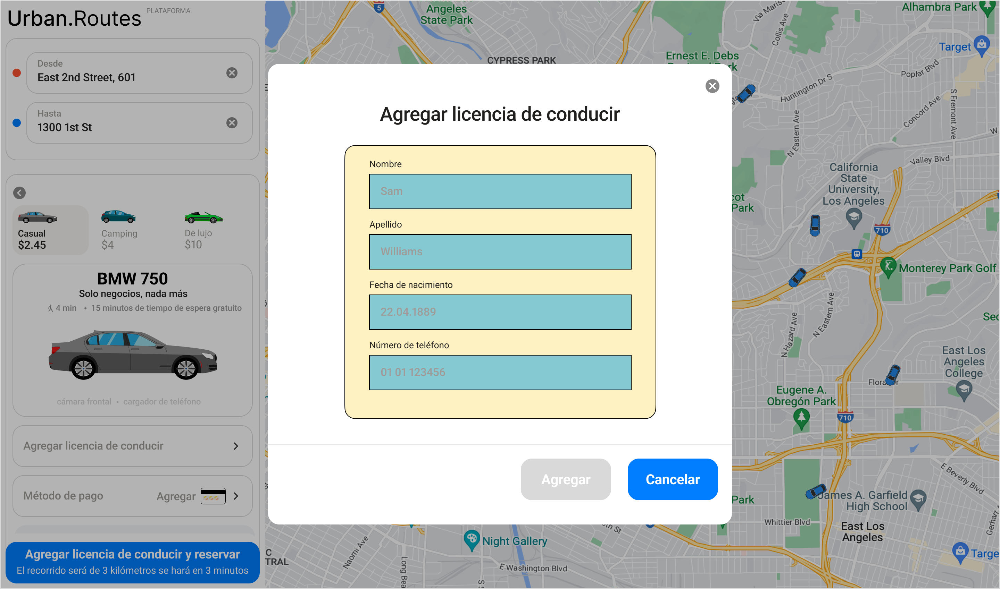

# Equivalence Partitioning & Boundary Value Analysis: Driver's License Form

## Input Fields Validation Scope
* **Fields Under Test:** Name, Last Name.
* **Business Rules (Assumed/Required):** 
    * Minimum length: 2 characters.
    * Maximum length: 14 characters.
    * Allowed characters: Latin alphabet only (A-Z, a-z), spaces, and hyphens. No numbers or special characters.

---

## Equivalence Classes Partitioning (ECP) & Boundary Value Analysis (BVA) - Length Restrictions
<table>
  <tr>
    <th>Test Group</th>
    <th>Class Name</th>
    <th>Boundaries</th>
    <th>Test Data Within the Class (Field Content)</th>
    <th>Boundary Test Data (Field Content)</th>
  </tr>
<!-- Test Group: Name -->
  <tr>
    <td rowspan="10"><b>Name</b></td>
  </tr>

  <tr>
    <td>The text length is 2 to 14 characters.</td>
    <td>2, 14</td>
    <td>5 chars — "Ariel"</td>
    <td>2 — "Li" 14 — "Hermenegildina" 3 — "Ana" 
13 — "Ariel Testing"</td>
  </tr>

  <tr>
    <td>The text length is 1 character.</td>
    <td>1</td>
    <td></td>
    <td>1 char — "A"</td>
  </tr>

  <tr>
   <td>The text length is 15 characters or more.</td>
   <td>15</td>
   <td>19 chars — "Constantinopolitano"</td>
   <td>15 — "Hermenegildinos" 16 — "Constantinopolit"</td>
  </tr>

  <tr>
    <td>Empty Field.</td>
    <td></td>
    <td>0 — Empty string</td>
    <td></td>
  </tr>

  <tr>
    <td>Name with Latin alphabet characters.</td>
    <td></td>
    <td></td>
    <td></td>
  </tr>

  <tr>
    <td>Name with space in between.</td>
    <td></td>
    <td></td>
    <td></td>
  </tr>

  <tr>
    <td>Name with hyphen in between.</td>
    <td></td>
    <td>Luis-Felipe</td>
    <td></td>
  </tr>

  <tr>
    <td>Special characters.</td>
    <td></td>
    <td>André$</td>
    <td></td>
  </tr>

  <tr>
    <td>Characters from other languages.</td>
    <td></td>
    <td>加布里埃爾F加布爾</td>
    <td></td>
  </tr>
  
  <!-- Test Group: Last Name -->
  <tr>
    <td rowspan="10"><b>Last Name</b></td>
  </tr>

  <tr>
    <td>The text length is 2 to 14 characters.</td>
    <td>2, 14</td>
    <td>6 chars — "Méndez"</td>
    <td>2 — "Oz" 14 — "Saltalamacchia" 3 — "Gil" 
13 — "Ponce de León"</td>
  </tr>

  <tr>
    <td>The text length is 1 character.</td>
    <td>1</td>
    <td></td>
    <td>1 char — "A"</td>
  </tr>

  <tr>
   <td>The text length is 15 characters or more.</td>
   <td>15</td>
   <td>23 chars — "Garciarrubio de la Vega"</td>
   <td>15 — "Álvarez de Lara" 16 — "López-Villaseñor"</td>
  </tr>

  <tr>
    <td>Empty Field.</td>
    <td></td>
    <td>0 — Empty string</td>
    <td></td>
  </tr>

  <tr>
    <td>Last name with latin alphabet characters.</td>
    <td></td>
    <td></td>
    <td></td>
  </tr>

  <tr>
    <td>Name with space in between.</td>
    <td></td>
    <td></td>
    <td></td>
  </tr>

  <tr>
    <td>Name with hyphen in between.</td>
    <td></td>
    <td>Sanz-García</td>
    <td></td>
  </tr>

  <tr>
    <td>Special characters.</td>
    <td></td>
    <td>$ánchez</td>
    <td></td>
  </tr>

  <tr>
    <td>Characters from other languages.</td>
    <td></td>
    <td>加布里埃爾F加布爾</td>
    <td></td>
  </tr>
</table>